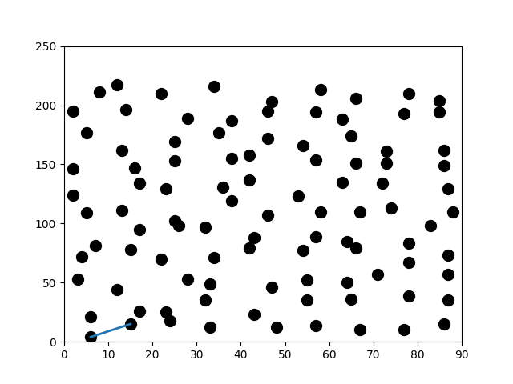

# Algorithm_mTSP

This project aims to find road trips for the multiple Traveling Salesman Problem (mTSP).
<p align="center"></p>
## Project Structure

The project is organized into several directories:

- **data**: This directory contains city instances for the mTSP, i.e., a list of points and their coordinates.

- **deliverable for school**: This directory contains three deliverables for an engineering school. These deliverables encompass three algorithms used for solving the mTSP.

- **genetic**: This directory contains the code for the genetic algorithm used for solving the mTSP.

- **greedy**: This directory contains the code for the greedy algorithm used for solving the mTSP.

## Getting Started

### Prerequisites

Make sure you have installed all of the following prerequisites on your development machine:

- Python 3.x
- Jupyter Notebook

To install the necessary libraries, run the following command:

```
pip install -r requirements.txt
```

### Running the Notebooks

You can start the Jupyter Notebook server with the following command:

```
jupyter notebook
```

Then, navigate to the notebook files (`.ipynb`) in the respective directories to run them.

## Contact

For any questions or concerns, please open an issue on this repository and we will get back to you as soon as possible.
